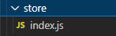

# Vue 3 + Vite
> 记录了vite构建工具创建的vue项目，并在项目中引入vuex，以及vuex的大概使用方法
## 1、创建项目
```javascript
npm init vite@latest
```
选择vue项目
## 2、安装vuex
```javascript
npm install vuex@next --save
```
## 3、创建store文件夹

### 3.1 在index.js文件中创建一个Store实例
```javascript
import Vuex from 'vuex';
// 创建一个新的 store 实例
let store = new Vuex.Store({
    state:{
        count:0
    },
    mutations:{
        increment (state) {
            state.count++
        }
    }
})
export default store;
```
### 3.2 main.js文件中引入创建的store实例
```javascript
import store from "./store/index.js"
const app = createApp(App)
//这里注意引入store的时机，要在app创建完成之前引入
app.use(store)
app.mount('#app')
```
### 可能遇到的需求
1、在组件中引用vuex状态（组件计算属性computed）
2、组件和vuex状态一起计算得到某个值
3、在组件中修改vuex的状态（vuex的mutations，组件的this.$store.commit），修改的同时提交参数
4、组件获取vuex的state派生的状态，比如从state的某数组中过滤得到某一个值

> mutations处理同步操作  
> Action处理异步操作

模块化使用
module文件夹下定义文件main.js
```javascript
const main = {
    // namespaced: true,
    state:{
        main_count:0,
        todos: [
            { id: 1, text: '...', done: true },
            { id: 2, text: '...', done: false },
            { id: 3, text: '...', done: false }
          ]
    },
    mutations:{
        main_increment (state,payload) {
            state.main_count +=payload.amount
        },
    },
    getters:{
        getMain_count:state=>id=>{
            return state.todos.find(todo => todo.id === id)
        }
    }
}
export default main
```
在index.js引入
```javascript
import Vuex from 'vuex';

import main from "./module/main.js"
// 创建一个新的 store 实例
let store = new Vuex.Store({
    namespaced: true,
    //......省略一万字
    modules:{
        main:main,
    },
})

export default store;
```
> 模块化定义如上形式，访问模块状态如下 
```javascript
this.$store.state.main.main_count
```
> 访问模块 mutations 如下，不加命名空间跟正常访问没什么不一样
> 注意：不推荐不加命名空间，无法解决两个模块之间方法一样的情况，如果真的出现相同的情况，那就全执行
```javascript
this.$store.getters.getMain_count(3)
this.$store.commit("main_increment",{amount:1})
```
### 加命名空间
```javascript
//传统访问模块 state
console.log(this.$store.state['main']['main_count'])
//访问模块 getter
console.log(this.$store.getters['main/getMain_count'](3))
//模块的 mutations
console.log(this.$store.commit("main/main_increment",{
        amount:1
    })
)
this.$store.commit({
    type:"main/main_increment",
    amount:1
})
```
- 辅助函数平时用的不多，有缘再写